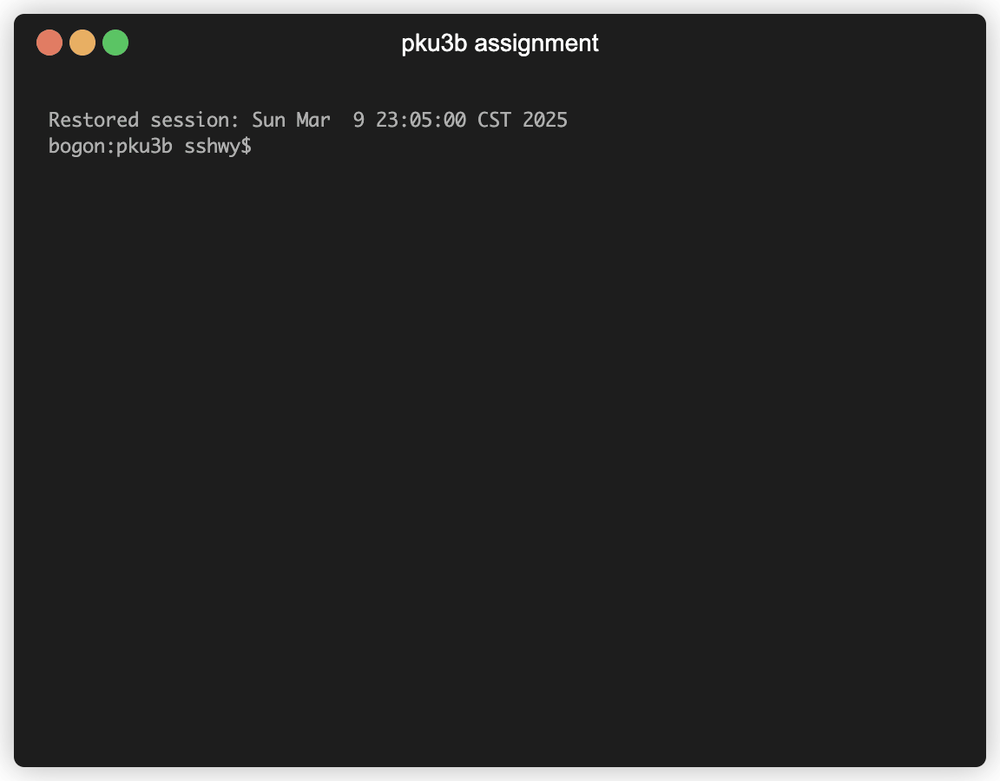

# PKU3b: A Better Black Board for PKUers 🎓

> This project is currently under active development. 🚧

[](https://crates.io/crates/pku3b)


如果这个项目为你带来了便利，不妨给个 star ⭐ 支持一下～

pku3b 是一个由 Rust 实现的小巧 (~10MB) 命令行工具，用于爬取北京大学教学网 (<https://course.pku.edu.cn>) 的信息。目前它可以

- 📋 查看课程作业信息（未完成/全部）
- 📂 下载课程作业附件
- 📤 提交课程作业
- 🎥 查看课程回放列表
- ⏯️ 下载课程回放（需要 ffmpeg）

基本用法如下：

```text
A tool for PKU students to check their courses.

Usage: pku3b [COMMAND]

Commands:
  assignment  获取课程作业信息/下载附件/提交作业 [aliases: a]
  video       获取课程回放/下载课程回放 [aliases: v]
  init        (重新) 初始化配置选项
  config      显示或修改配置项
  cache       查看缓存大小/清除缓存
  help        Print this message or the help of the given subcommand(s)

Options:
  -h, --help     Print help (see more with '--help')
  -V, --version  Print version
```

## Demo 🎬

查看作业/下载附件:



查看/下载课程回放，支持断点续传 (10 倍速):


## Getting Started 🚀

### [1/3] Install `pku3b`

首先你需要安装 `pku3b` 本身。**在安装完成后请重新开一个终端窗口，否则会找不到该命令**。

#### Build from Source

这个安装方式在 Win/Linux/Mac 上均适用。

如果你的电脑上恰好有 rust 工具链，那么建议你使用 cargo 安装最新版本。如果需要更新，只需再次执行这个命令：

```bash
cargo install pku3b
```

#### Windows 🖥️

对于 Windows 系统，你可以在终端（Powershell/Terminal）执行命令来安装 pku3b。首先你可以执行以下命令来确保终端可以访问 Github。如果该命令输出 `200`，说明成功:

```powershell
(Invoke-WebRequest -Uri "https://github.com/sshwy/pku3b" -Method Head).StatusCode
```

为了保证你能够执行远程下载的批处理脚本，你需要暂时关闭【Windows 安全中心 > 病毒和威胁防护 > 管理设置 > 实时保护】，然后执行以下命令（直接复制全部文本粘贴至命令行）来安装指定版本的 pku3b (当前最新版 `0.8.1`):

```powershell
Invoke-WebRequest `
  -Uri "https://raw.githubusercontent.com/sshwy/pku3b/refs/heads/master/assets/windows_install.bat" `
  -OutFile "$env:TEMP\script.bat"; `
Start-Process `
  -FilePath "$env:TEMP\script.bat" `
  -ArgumentList "0.8.1" `
  -NoNewWindow -Wait
```

安装过程大致如下:

```powershell
Step 1: Downloading pku3b version 0.8.1...
Download complete.
Step 2: Extracting pku3b version 0.8.1...
Extraction complete.
Step 3: Moving pku3b.exe to C:\Users\Sshwy\AppData\Local\pku3b\bin...
移动了         1 个文件。
File moved to C:\Users\Sshwy\AppData\Local\pku3b\bin.
Step 4: Checking if C:\Users\Sshwy\AppData\Local\pku3b\bin is in the PATH variable...
C:\Users\Sshwy\AppData\Local\pku3b\bin is already in the PATH variable.
Installation complete!
请按任意键继续. . .
```

#### MacOS 🍏

你可以使用 Homebrew 安装 (你需要保证你的终端可以访问 Github):

```bash
brew install sshwy/tools/pku3b
```

#### Linux 🐧

你可以从 [Release](https://github.com/sshwy/pku3b/releases) 页面中找到你所使用的操作系统对应的版本，然后下载二进制文件，放到应该放的位置，然后设置系统的环境变量。你也可以不设置环境变量，而是直接通过文件路径来执行这个程序。

### [2/3] Install FFmpeg (optional)

如果需要使用下载课程回放的功能，你需要额外安装 `ffmpeg`:

- 在 Windows 🖥️ 上推荐使用 winget 安装: `winget install ffmpeg`。如果您艺高人胆大，也可以手动从官网上下载二进制文件安装，然后将 `ffmpeg` 命令加入系统环境变量。
- 在 MacOS 🍏 上可以使用 Homebrew 安装: `brew install ffmpeg`；
- 在 Linux 🐧 上使用发行版的包管理器安装（以 Ubuntu 为例）: `apt install ffmpeg`；

安装完成后请新开一个终端窗口，并执行 `ffmpeg` 命令检查是否安装成功（没有显示“找不到该命令”就说明安装成功）。

### [3/3] Initialization

在首次执行命令前你需要登陆教学网。执行以下命令，根据提示输入教学网账号密码来完成初始化设置（只需要执行一次）：

```bash
pku3b init
```

完成初始化设置后即可使用该工具啦。如果之后想修改配置，可以使用 `pku3b config -h` 查看帮助。

更多示例:

- 📋 查看未完成的作业列表: `pku3b a ls`
- 📋 查看全部作业列表: `pku3b a ls -a`
- 📂 下载作业附件: `pku3b a down <ID>`: ID 请在作业列表中查看
- 📂 交互式下载作业附件: `pku3b a down`: ID 请在作业列表中查看
- 📤 提交作业: `pku3b a sb <ID> <PATH>`: PATH 为文件路径，可以是各种文件，例如 pdf、zip、txt 等等
- 📤 交互式提交作业: `pku3b a sb`: 会在当前工作目录中寻找要提交的作业
- 🎥 查看课程回放列表: `pku3b v ls`
- 🎥 查看所有学期课程回放列表: `pku3b v ls --all-term`
- ⏯️ 下载课程回放: `pku3b v down <ID>`: ID 请在课程回放列表中复制，该命令会将视频转换为 mp4 格式保存在执行命令时所在的目录下（如果要下载历史学期的课程回放，需要使用 `--all-term` 选项）。
- 🗑️ 查看缓存占用: `pku3b cache`
- 🗑️ 清空缓存: `pku3b cache clean`
- ❓ 查看某个命令的使用方法 (以下载课程回放的命令为例): `pku3b help v down`
- ⚙️ 输出调试日志:
  - 在 Windows 上：设置终端环境变量（临时）`$env:RUST_LOG = 'info'`，那么在这个终端之后执行的 pku3b 命令都会输出调试日志。
  - 在 Linux/Mac 上：同样可以设置终端环境变量 `export RUST_LOG=info`；另外一个方法是在执行 pku3b 的命令前面加上 `RUST_LOG=info`，整个命令形如 `RUST_LOG=info pku3b [arguments...]`

## Motivation 💡

众所周知 PKU 的教学网 UI 长得非常次时代，信息获取效率奇低。对此已有的解决方案是借助 [PKU-Art](https://github.com/zhuozhiyongde/PKU-Art) 把 UI 变得赏心悦目一点。

但是如果你和我一样已经进入到早十起不来、签到不想管、不知道每天要上什么课也不想关心、对教学网眼不见为净的状态，那我猜你至少会关注作业的 DDL，或者期末的时候看看回放。于是 `pku3b` 应运而生。在开发项目的过程中又有了更多想法，于是功能就逐渐增加了。

其他同学在本项目基础上新增了更多爬取功能，打包成python库和MCP server，未来这些功能会合并至本项目，如果感兴趣的可以访问：[pku3b_AI](https://github.com/JKay15/pku3b_AI)
