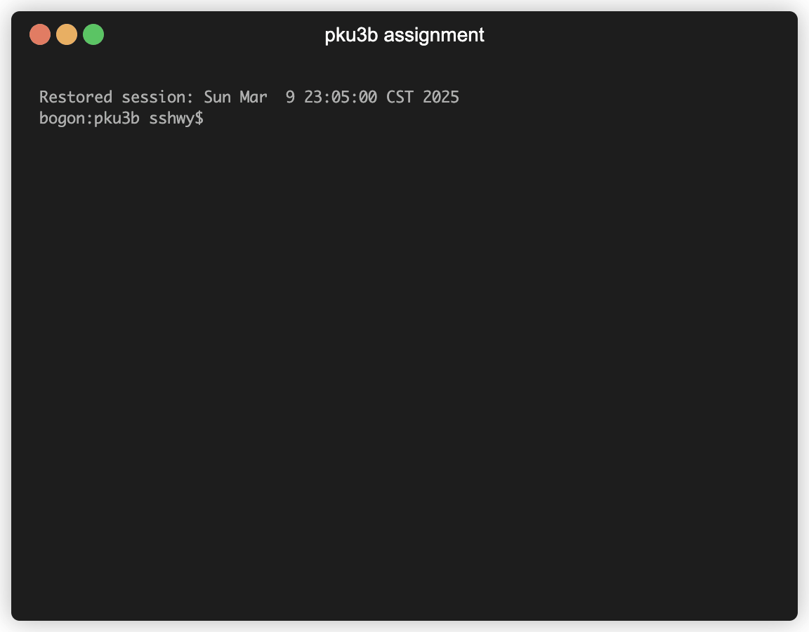

# PKU3b: A Better Black Board for PKUers 🎓

[](https://crates.io/crates/pku3b)


如果这个项目为你带来了便利，不妨给个 star ⭐ 支持一下～

pku3b 被用于以下开源项目：

- AutoPku: [[repo]](https://github.com/ICUlizhi/AutoPku) [[website]](https://autopku.com/) by @ICUlizhi
- pku3b_AI: [[repo]](https://github.com/JKay15/pku3b_AI) by @JKay15

如果您的开源项目用到了 pku3b，欢迎发起 PR 将你的项目添加到上述列表！

## Overview

pku3b 是一个由 Rust 实现的小巧 (~10MB) 命令行工具，用于爬取北京大学教学网 (<https://course.pku.edu.cn>) 的信息。目前它可以

- 📋 查看课程作业信息（未完成/全部）
- 📂 下载课程作业附件
- 📤 提交课程作业
- 📅 查看个人课表
- 📢 查看课程公告（支持列表与按 ID 查看详情）
- 🎥 查看课程回放列表
- ⏯️ 下载课程回放（需要 ffmpeg）
- 🎓 快捷选课（你懂我什么意思吧）
- 📊 查看课程成绩
- 📱 Bark 通知推送（可选，用于选课成功通知）
- 🧑‍🏫 助教功能：查看批改组、批量下载作业、逐人登分

> [!TIP]
> 不想看使用教程？您可以在安装之后，使用以下 prompt 让您的 AI 工具学会使用 `pku3b`：
>
> ```text
> 执行 `pku3b -h` 并对子命令执行 `pku3b help [args]` 命令，总结 `pku3b` 的所有用法
> ```

基本用法如下：

```text
A tool for PKU students to check their courses.

Usage: pku3b [OPTIONS] [COMMAND]

Commands:
  assignment  获取课程作业信息/下载附件/提交作业 [aliases: a]
  course-content  获取课程内容 [aliases: cc]
  coursetable 获取个人课表 [aliases: ct]
  announcement 获取课程公告 [aliases: ann]
  video       获取课程回放/下载课程回放 [aliases: v]
  grades      查看课程成绩 [aliases: g]
  ta          助教功能：查看批改组、下载作业、登分
  syllabus    选课操作 [aliases: s]
  ttshitu     图形验证码识别 [aliases: tt]
  bark        Bark通知设置 [aliases: b]
  init        (重新) 初始化用户名/密码
  config      显示或修改配置项
  cache       查看缓存大小/清除缓存
  help        Print this message or the help of the given subcommand(s)

Options:
      --config <PATH>     配置文件路径 (优先级高于 PKU3B_CONFIG) [env: PKU3B_CONFIG=]
      --cache-dir <PATH>  缓存目录路径 (优先级高于 PKU3B_CACHE_DIR) [env: PKU3B_CACHE_DIR=]
  -h, --help            Print help (see more with '--help')
  -V, --version         Print version
```

## Demo 🎬

查看作业/下载附件:



查看/下载课程回放，支持断点续传 (10 倍速):


## Getting Started 🚀

### [1/3] Install `pku3b`

首先你需要安装 `pku3b` 本身。**在安装完成后请重新开一个终端窗口，否则会找不到该命令**。

#### Build from Source

这个安装方式在 Win/Linux/Mac 上均适用。

如果你的电脑上恰好有 rust 工具链，那么建议你使用 cargo 安装最新版本。如果需要更新，只需再次执行这个命令：

```bash
cargo install pku3b
```

#### Windows 🖥️

对于 Windows 系统，你可以在终端（Powershell/Terminal）执行命令来安装 pku3b。首先你可以执行以下命令来确保终端可以访问 Github。如果该命令输出 `200`，说明成功:

```powershell
(Invoke-WebRequest -Uri "https://github.com/sshwy/pku3b" -Method Head).StatusCode
```

为了保证你能够执行远程下载的批处理脚本，你需要暂时关闭【Windows 安全中心 > 病毒和威胁防护 > 管理设置 > 实时保护】，然后执行以下命令（直接复制全部文本粘贴至命令行）来安装指定版本的 pku3b (当前最新版 `0.12.0`):

```powershell
Invoke-WebRequest `
  -Uri "https://raw.githubusercontent.com/sshwy/pku3b/refs/heads/master/assets/windows_install.bat" `
  -OutFile "$env:TEMP\script.bat"; `
Start-Process `
  -FilePath "$env:TEMP\script.bat" `
  -ArgumentList "0.12.0" `
  -NoNewWindow -Wait
```

安装过程大致如下:

```powershell
Step 1: Downloading pku3b version 0.12.0...
Download complete.
Step 2: Extracting pku3b version 0.12.0...
Extraction complete.
Step 3: Moving pku3b.exe to C:\Users\Sshwy\AppData\Local\pku3b\bin...
移动了         1 个文件。
File moved to C:\Users\Sshwy\AppData\Local\pku3b\bin.
Step 4: Checking if C:\Users\Sshwy\AppData\Local\pku3b\bin is in the PATH variable...
C:\Users\Sshwy\AppData\Local\pku3b\bin is already in the PATH variable.
Installation complete!
请按任意键继续. . .
```

#### MacOS 🍏

你可以使用 Homebrew 安装 (你需要保证你的终端可以访问 Github):

```bash
brew install sshwy/tools/pku3b
```

#### Linux 🐧

你可以从 [Release](https://github.com/sshwy/pku3b/releases) 页面中找到你所使用的操作系统对应的版本，然后下载二进制文件，放到应该放的位置，然后设置系统的环境变量。你也可以不设置环境变量，而是直接通过文件路径来执行这个程序。

### [2/3] Install FFmpeg (optional)

如果需要使用下载课程回放的功能，你需要额外安装 `ffmpeg`:

- 在 Windows 🖥️ 上推荐使用 winget 安装: `winget install ffmpeg`。如果您艺高人胆大，也可以手动从官网上下载二进制文件安装，然后将 `ffmpeg` 命令加入系统环境变量。
- 在 MacOS 🍏 上可以使用 Homebrew 安装: `brew install ffmpeg`；
- 在 Linux 🐧 上使用发行版的包管理器安装（以 Ubuntu 为例）: `apt install ffmpeg`；

安装完成后请新开一个终端窗口，并执行 `ffmpeg` 命令检查是否安装成功（没有显示“找不到该命令”就说明安装成功）。

### [3/3] Initialization

在首次执行命令前你需要登陆教学网。执行以下命令，根据提示输入教学网账号密码来完成初始化设置（只需要执行一次）：

```bash
pku3b init
```

完成初始化设置后即可使用该工具啦。如果之后想修改配置，可以使用 `pku3b config -h` 查看帮助。

### 配置文件路径

默认情况下，`pku3b init` 会把配置写入系统的应用配置目录，后续命令也会从同一个默认位置读取配置。如果需要为不同账号、不同环境或临时测试使用另一份配置文件，可以使用全局参数 `--config <PATH>` 指定配置文件路径：

```bash
pku3b --config ./cfg.toml init
pku3b --config ./cfg.toml coursetable
pku3b --config ./cfg.toml config username
```

也可以通过环境变量 `PKU3B_CONFIG` 指定默认配置文件路径：

```bash
PKU3B_CONFIG=./cfg.toml pku3b coursetable
```

命令行参数 `--config` 的优先级高于环境变量 `PKU3B_CONFIG`。

### 敏感信息存储

默认情况下，`pku3b` 会把配置写入本地配置文件。若希望密码、TT 识图账号密码和 Bark token 不以明文形式保存在配置文件中，可以使用 `keyring` 后端，将敏感信息交给系统钥匙串/密钥环保存。

`keyring` 后端需要二进制在构建时启用 `keyring` feature。使用 cargo 安装时可以这样安装：

```bash
cargo install pku3b --features keyring
```

初始化配置后，执行以下命令即可把敏感信息迁移到系统 keyring，并在配置文件中清空对应明文字段：

```bash
pku3b config secret-backend keyring
```

之后正常使用 `pku3b` 即可。若需要恢复为明文配置文件存储，可以执行：

```bash
pku3b config secret-backend plaintext
```

如果当前配置使用了 `secret_backend = "keyring"`，但正在运行的 `pku3b` 没有启用 `keyring` feature，程序会提示需要使用支持 keyring 的构建。

### 缓存目录

`pku3b` 会把登录状态、接口缓存和课程回放下载过程中的临时分片保存到缓存目录中。默认缓存目录由操作系统决定；如果课程回放较大，或默认缓存目录所在磁盘空间不足，可以使用全局参数 `--cache-dir <PATH>` 指定新的缓存目录：

```bash
pku3b --cache-dir ./cache/pku3b cache show
pku3b --cache-dir /data/pku3b-cache video download <VIDEO_ID>
```

也可以通过环境变量 `PKU3B_CACHE_DIR` 指定默认缓存目录：

```bash
PKU3B_CACHE_DIR=./cache/pku3b pku3b cache show
```

命令行参数 `--cache-dir` 的优先级高于环境变量 `PKU3B_CACHE_DIR`。

## 助教功能 🧑‍🏫

如果你是课程助教，`pku3b ta` 系列命令可以帮助你管理批改流程。

### 查看批改组

```bash
pku3b ta group ls          # 列出所有批改组及人数
pku3b ta group show <ID>   # 查看某组成员
```

### 管理作业提交

```bash
pku3b ta hw ls             # 列出作业及已评/未评分数
pku3b ta hw ls -g 1        # 按批改组筛选
pku3b ta hw review         # 查看评分复核状态
pku3b ta hw review -g 1    # 按组查看复核状态
```

### 批量下载

```bash
pku3b ta hw down           # 交互选择作业下载
pku3b ta hw down -g 1      # 只下载某组提交
pku3b ta hw down -u        # 只下载未评分
pku3b ta hw down -A        # 下载全部（含已评分）
pku3b ta hw down --all-hw  # 一键下载所有作业未评分提交
```

### 交互式登分

`pku3b ta hw grade` 会逐个学生提示输入分数和评语，自动提交到教学网。输入 `q` 跳过当前学生，`e` 退出评分。

```bash
pku3b ta hw grade          # 交互登分（仅未评分）
pku3b ta hw grade -g 1     # 指定批改组
pku3b ta hw grade --recheck  # 复查已评分提交
```

### 配置

在 `config.toml` 中可预设默认值：

```toml
ta_group_id = "group_12345"   # 默认批改组，避免每次选择
ta_latest_only = true         # 仅保留每人最新提交（自动淘汰逾期前版本）
ta_rename_files = true        # 下载时重命名为 "学号_姓名_原始文件名"
```

> [!TIP]
> 建议配置 `ta_group_id` 为自己的批改组 ID，这样每次执行 `ta hw` 命令时无需重复选择。

### 典型工作流

```bash
# 1. 查看有哪些作业和批改组
pku3b ta group ls
pku3b ta hw ls

# 2. 一键下载自己组所有未评分作业
pku3b ta hw down --all-hw

# 3. 本地批改后，交互式登分
pku3b ta hw grade -g 1

# 4. 确认评分状态
pku3b ta hw review -g 1
```

## Bark 通知功能 📱

pku3b 支持通过 [Bark](https://apps.apple.com/cn/app/bark-customed-notifications/id1403753865) 发送选课通知到 iPhone/iPad：

- **选课开始通知**: 自动选课程序启动时发送
- **选课成功通知**: 成功选上课程时发送
- **登录失败通知**: 无法登录选课网时发送
- **选课循环中断通知**: 选课过程中出现异常时发送

配置步骤：

1. 在 App Store 下载 Bark 应用
2. 获取你的 Bark 推送令牌
3. 执行 `pku3b bark init` 配置令牌
4. 执行 `pku3b bark test` 测试通知功能

**注意：Bark 通知是完全可选的功能，不配置也不会影响选课程序的正常运行。**

## 更多示例

- 📋 查看未完成的作业列表: `pku3b a ls`
- 📋 查看全部作业列表: `pku3b a ls -a`
- 📂 下载作业附件: `pku3b a down <ID>`: ID 请在作业列表中查看
- 📂 交互式下载作业附件: `pku3b a down`: ID 请在作业列表中查看
- 📤 提交作业: `pku3b a sb <ID> <PATH>`: PATH 为文件路径，可以是各种文件，例如 pdf、zip、txt 等等
- 📤 交互式提交作业: `pku3b a sb`: 会在当前工作目录中寻找要提交的作业
- 📅 查看个人课表: `pku3b coursetable` 或 `pku3b ct`
- 📅 查看个人课表（原始JSON）: `pku3b coursetable --raw`
- 📊 查看当前学期成绩: `pku3b grades` 或 `pku3b g`
- 📊 查看所有学期成绩: `pku3b grades --all-term`
- 📢 查看课程公告列表: `pku3b announcement ls`
- 📢 按 ID 查看公告详情: `pku3b announcement show <ID>`
- 🎥 查看课程回放列表: `pku3b v ls`
- 🎥 查看所有学期课程回放列表: `pku3b v ls --all-term`
- ⏯️ 下载课程回放: `pku3b v down <ID>`: ID 请在课程回放列表中复制，该命令会将视频转换为 mp4 格式保存在执行命令时所在的目录下（如果要下载历史学期的课程回放，需要使用 `--all-term` 选项）。
- 📱 初始化 Bark 通知: `pku3b bark init` 或 `pku3b b init`
- 📱 测试 Bark 通知: `pku3b bark test` 或 `pku3b b test`
- 🧩 初始化 TT 识图账号密码: `pku3b ttshitu init`
- 🧩 测试 TT 识图配置是否成功: `pku3b ttshitu test`
- 📚 交互式选择课程并加入快捷选课列表: `pku3b s set`
- 📚 交互式移除快捷选课列表中的课程: `pku3b s unset`
- ⚙️ 查看快捷选课列表配置: `pku3b config`
- 🔁 启动快捷选课循环（如配置了 Bark 会自动发送通知）: `pku3b s launch`
- 🧑‍🏫 列出批改组: `pku3b ta group ls`
- 🧑‍🏫 查看批改组成员: `pku3b ta group show <ID>`
- 🧑‍🏫 查看作业评分数: `pku3b ta hw ls`
- 🧑‍🏫 下载学生作业提交: `pku3b ta hw down`
- 🧑‍🏫 交互式登分: `pku3b ta hw grade`
- 🗑️ 查看缓存占用: `pku3b cache`
- 🗑️ 清空缓存: `pku3b cache clean`
- ❓ 查看某个命令的使用方法 (以下载课程回放的命令为例): `pku3b help v down`
- ⚙️ 输出调试日志:
  - 在 Windows 上：设置终端环境变量（临时）`$env:RUST_LOG = 'info'`，那么在这个终端之后执行的 pku3b 命令都会输出调试日志。
  - 在 Linux/Mac 上：同样可以设置终端环境变量 `export RUST_LOG=info`；另外一个方法是在执行 pku3b 的命令前面加上 `RUST_LOG=info`，整个命令形如 `RUST_LOG=info pku3b [arguments...]`

## Motivation 💡

众所周知 PKU 的教学网 UI 长得非常次时代，信息获取效率奇低。对此已有的解决方案是借助 [PKU-Art](https://github.com/zhuozhiyongde/PKU-Art) 把 UI 变得赏心悦目一点。

但是如果你和我一样已经进入到早十起不来、签到不想管、不知道每天要上什么课也不想关心、对教学网眼不见为净的状态，那我猜你至少会关注作业的 DDL，或者期末的时候看看回放。于是 `pku3b` 应运而生。在开发项目的过程中又有了更多想法，于是功能就逐渐增加了。
